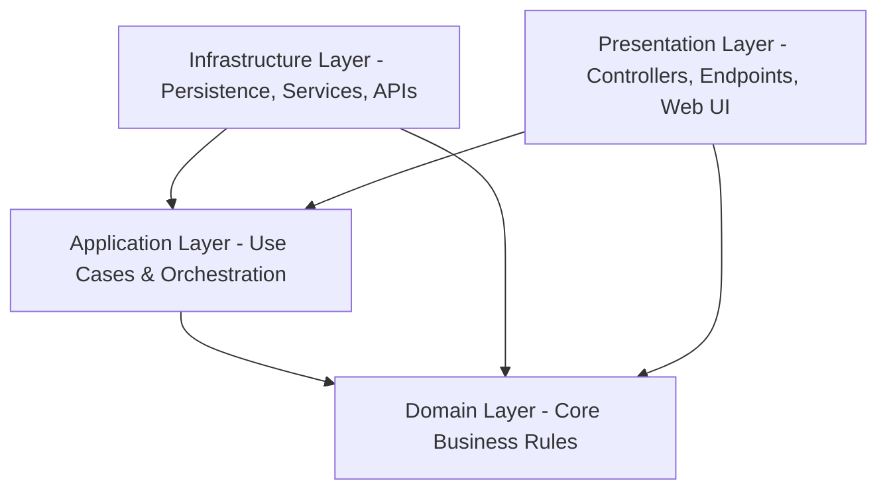

# 1. Clean Architecture Overview

This document provides a comprehensive overview of the Clean Architecture pattern for modern .NET applications.

## Core Principles

Clean Architecture focuses on the separation of concerns and dependency inversion. The main goal is to build an application that is independent of frameworks, databases, user interfaces, or any external agency.



1. **Dependency Inversion is the Foundation**
   - All dependencies point **inward**.
   - The **Domain** layer has zero project references and depends only on pure C# primitives.
   - The **Application** layer references only the Domain layer.
   - The **Infrastructure** layer implements interfaces defined in Application or Domain.
   - The **Presentation/API** layer maps HTTP requests to Use Cases (MediatR commands/queries) and relies on dependency injection to wire up implementations at runtime.
   - The compiler strictly enforces these rules through project reference constraints.

2. **Domain Owns the Business Rules**
   - Business logic is encapsulated inside the Domain layer as rich entities, domain services, or specifications.
   - It remains framework-agnostic.

3. **Use Cases are the Unit of Work**
   - Instead of large service classes with dozens of methods, each use case (Command or Query) is a single, focused class implementing `IRequest` and its corresponding `IRequestHandler` from MediatR.
   - This prevents code bloat, simplifies maintenance, and isolates changes.

4. **Infrastructure is a Plugin**
   - Databases (EF Core), external APIs, file storage, email providers, and identity systems live in Infrastructure.
   - They implement interfaces defined in Application or Domain.
   - If you need to swap SQL Server for PostgreSQL (or vice versa), or SendGrid for AWS SES, you only touch the Infrastructure layer.

5. **The API/Presentation Layer is Thin**
   - Endpoints or Controllers have zero business logic.
   - Their sole responsibility is to receive HTTP requests, validate basic structure, dispatch to MediatR, and return appropriate HTTP status codes based on the use case's `Result` envelope.

---

## 4-Project Directory Layout

When spinning up a new solution, organize your folders as follows:

```
src/
  ├── MyProject.Domain/
  │    ├── Common/               # BaseEntity, Result, ValueObjects
  │    ├── Entities/             # Rich Domain Entities (e.g., Product.cs)
  │    ├── Enums/                # Domain enums
  │    ├── Exceptions/           # Domain-specific exceptions
  │    └── ValueObjects/         # Immutable value objects
  │
  ├── MyProject.Application/
  │    ├── Common/
  │    │    ├── Behaviors/       # ValidationBehavior, LoggingBehavior
  │    │    └── Interfaces/      # IAppDbContext, ICurrentUserService
  │    ├── Features/             # CQRS folders divided by aggregates
  │    │    └── Products/
  │    │         ├── Commands/   # Create, Update, Delete
  │    │         └── Queries/    # List, Details, Enums
  │    └── Common/Mappings/      # MappingProfile
  │
  ├── MyProject.Infrastructure/
  │    ├── Persistence/
  │    │    ├── AppDbContext.cs  # EF Core DbContext implementing IAppDbContext
  │    │    ├── Configurations/  # Fluent API Configurations (Clean configurations)
  │    │    └── Migrations/      # EF Core Migrations
  │    ├── Services/             # Implementations of Application interfaces (Email, Storage)
  │    └── DependencyInjection.cs# DI Registration extension method
  │
  └── MyProject.WebUI/ (or MyProject.Api)
       ├── Controllers/          # API Controllers inheriting ApiControllerBase
       ├── Endpoints/            # Minimal API Endpoints implementing IEndpointGroup
       ├── Middlewares/          # ExceptionHandlingMiddleware
       ├── Program.cs            # Entry point and DI wiring
       └── appsettings.json      # Configuration settings
```

---

## Key architectural Decisions

| Aspect | Recommendation | Rationale |
| :--- | :--- | :--- |
| **Architectural Style** | Clean Architecture (CA) | Best for medium-to-high domain complexity where logic must remain stable over a long-lived project. |
| **Use Cases** | CQRS via MediatR | Separates write logic (Commands) from read logic (Queries) for better scaling, testing, and performance. |
| **Abstractions** | `IAppDbContext` | Direct access to EF Core's `DbSet<T>` in Application. **Do not** write a repository wrapper around DbSet unless complex, isolated query caching is required. DbSet is already a generic repository. |
| **MediatR Pipeline** | `ValidationBehavior` | Intercepts commands before reaching handlers, running FluentValidation rules automatically and throwing validation exceptions to be caught by API middleware. |
