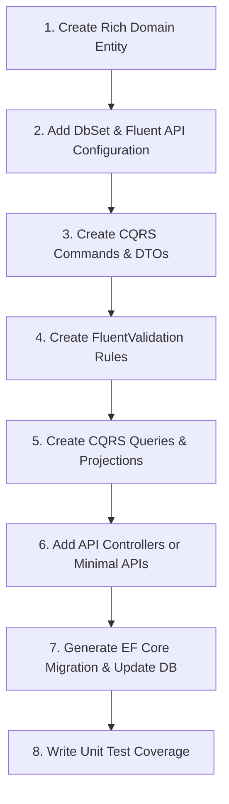

# 6. Step-by-Step Entity Scaffolding Checklist

This document acts as a complete, step-by-step handbook for developers creating a new Entity and its complete CRUD flow from scratch under this architecture.

---

## The Complete Developer Workflow

Follow these steps in sequence when introducing a new feature or database entity:



---

### Step 1: Create the Rich Domain Entity
Create a file under `src/Domain/Entities/{EntityName}.cs`.
- Ensure it inherits from `BaseEntity`.
- Define properties with `private set` or `protected set`.
- Add a parameterless `private` constructor for EF Core.
- Write a `public static {EntityName} Create(...)` static factory method.
- Add behavior methods for updates (`Update(...)`) or actions.
- Avoid parameterized constructors and public setters.

---

### Step 2: Configure the Database Entity Mapping
1. **Register the `DbSet` in `IAppDbContext` (Application Layer):**
   ```csharp
   DbSet<{EntityName}> {EntityName}Plural { get; }
   ```
2. **Implement in `AppDbContext` (Infrastructure Layer):**
   ```csharp
   public DbSet<{EntityName}> {EntityName}Plural => Set<{EntityName}>();
   ```
3. **Write Fluent API Configurations:**
   Create a mapping configuration class inside `src/Infrastructure/Persistence/Configurations/{EntityName}Configuration.cs`:
   ```csharp
   using Domain.Entities;
   using Microsoft.EntityFrameworkCore;
   using Microsoft.EntityFrameworkCore.Metadata.Builders;

   namespace Infrastructure.Persistence.Configurations;

   public class {EntityName}Configuration : IEntityTypeConfiguration<{EntityName}>
   {
       public void Configure(EntityTypeBuilder<{EntityName}> builder)
       {
           builder.HasKey(x => x.Id);
           builder.Property(x => x.Property1).HasMaxLength(200).IsRequired();
           
           // Filter out deleted records globally by default
           builder.HasQueryFilter(x => !x.IsDeleted);
       }
   }
   ```

---

### Step 3: Scaffold CQRS Commands (Write Operations)
Create commands, validators, and handlers under `src/Application/Features/{FeatureName}/Commands/`:
1. **Create Command:** Create `Create{EntityName}Dto.cs`, `Create{EntityName}Command.cs`, `Create{EntityName}CommandHandler.cs`, and `Create{EntityName}CommandValidator.cs`.
2. **Update Command:** Create DTO (excluding immutable fields), command, and handler. Use the entity's encapsulated `.Update(...)` behavior instead of AutoMapper.
3. **Delete Command:** Create a simple command carrying the record `Id`. Perform an ownership check, and invoke `.SoftDelete(...)` on the entity.

---

### Step 4: Scaffold CQRS Queries (Read Operations)
Create queries and handlers under `src/Application/Features/{FeatureName}/Queries/`:
1. **Details Query:** Returns details of a single entity. Perform rich validation (404 if null, 410 if soft-deleted, 423 if inactive).
2. **List Query (Paginated):** Implement search, sort, and pagination.
   - Project database fields directly to query DTOs using `.Select()`.
   - Never load full database tracking entities for read-only listings.

---

### Step 5: Wire Up API Endpoints
Select one of the presentation choices:
- **API Controller:** Create `{EntityName}PluralController.cs` inheriting `ApiControllerBase` under `src/WebUI/Controllers/`.
- **Minimal API:** Create `{EntityName}Endpoints.cs` implementing `IEndpointGroup` under `src/WebUI/Endpoints/`.

---

### Step 6: Generate EF Core Database Migration
Run these commands inside your terminal from the **solution root directory**:

1. **Add the migration:**
   ```bash
   dotnet ef migrations add Add{EntityName} -p src/MyProject.Infrastructure -s src/MyProject.WebUI
   ```
   *(Specifies Infrastructure as the migration target, and WebUI as the startup assembly containing Program.cs)*

2. **Update the database:**
   ```bash
   dotnet ef database update -p src/MyProject.Infrastructure -s src/MyProject.WebUI
   ```

---

### Step 7: Write Unit Test Coverage
Write tests in your `src/MyProject.Application.UnitTests` project:
- Create validator unit tests using the `.TestValidate(...)` FluentValidation extension.
- Create handler unit tests using `TestDbContextFactory.CreateInMemoryDbContext()`.
- Mock external dependencies (`ICurrentUserService`, `TimeProvider`) using Moq.
- Assert expected Vietnamese error messages.

---

### Step 8: Build and Run
Verify that the solution compiles and all tests pass:
```bash
dotnet build
dotnet test
```
